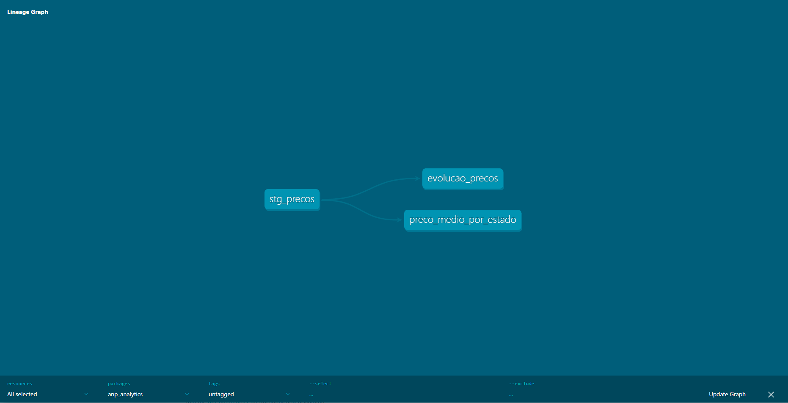

# Fuel Prices Pipeline (ANP)

🇺🇸 English | [🇧🇷 Português](README.pt.md)

A data engineering pipeline that ingests Brazil's historical fuel price data (ANP), organizes it into layers, and transforms it into reliable analytical tables using **Python**, **PostgreSQL**, and **dbt**.

> A personal portfolio project working with real, messy public data from the Brazilian government (422k records per semester): cleaning, layered modeling, data quality tests, and analytical transformations.

## Architecture

The pipeline separates **ingestion** (Python) from **transformation** (dbt), following the ELT pattern: land raw data first, transform later with SQL.

```
ANP CSV  ──(Python/pandas)──►  raw_precos (PostgreSQL, raw)
                                    │
                                    ▼ (dbt)
                               stg_precos  (staging: cleaned & typed)
                                    │
                     ┌──────────────┴──────────────┐
                     ▼                              ▼
           preco_medio_por_estado          evolucao_precos
           (mart: avg price by state)      (mart: time series with
                                            7-day moving average)
```

### Lineage (auto-generated by dbt)



## Tech Stack

- **Python / pandas** — ingestion and raw CSV parsing
- **PostgreSQL** — relational database
- **dbt** — SQL transformations, tests, and documentation
- **dbt_utils** — data quality testing package
- **SQLAlchemy** — Python ↔ database connection
- **Git / GitHub** — version control

## Technical Highlights

- **Real-world data cleaning:** comma decimals (`7,97` → `7.97`), Brazilian date format (`dd/mm/yyyy` → `date`), and column name standardization.
- **Layered architecture** (medallion): raw data preserved, reusable staging, analytical marts.
- **Window functions:** 7-day moving average over a daily-aggregation CTE.
- **Automated data quality tests** (dbt): not-null and accepted-range checks (the range check also validates the decimal conversion itself).

## Data Quality Tests

Run with `dbt test`; they halt the pipeline if the data breaks any rule:

| Column | Test | Rule |
|--------|------|------|
| valor_venda | not_null | price never null |
| valor_venda | accepted_range | price between 0 and 50 (positive and plausible) |
| estado | not_null | state always present |
| produto | not_null | fuel type always present |
| data_coleta | not_null | date always present |

## How to Run

1. Clone the repo and set up the environment:
```bash
   git clone https://github.com/juniorvas/anp-fuel-prices.git
   cd anp-fuel-prices
   python -m venv venv
   # Windows: .\venv\Scripts\Activate
   # Mac/Linux: source venv/bin/activate
   pip install pandas sqlalchemy "psycopg[binary]" python-dotenv dbt-postgres
```

2. Download a CSV file from the ANP historical series (link below) and save it in `data/`.

3. Create an `anp` database in PostgreSQL and a `.env` file in the root:
```
   DB_PASSWORD=your_password_here
```

4. Run ingestion and transformations:
```bash
   python ingest_raw.py              # load raw CSV into PostgreSQL
   cd anp_analytics
   dbt deps                          # install dbt packages
   dbt run                           # build staging + marts
   dbt test                          # validate data quality
   dbt docs generate && dbt docs serve   # docs + lineage
```

## Data Source

Historical Series of Fuel Prices — ANP (Brazilian National Agency of Petroleum, Natural Gas and Biofuels), open data:
https://www.gov.br/anp/pt-br/centrais-de-conteudo/dados-abertos/serie-historica-de-precos-de-combustiveis

## Author

**Wallace Vasconcellos Junior**
[GitHub](https://github.com/juniorvas)